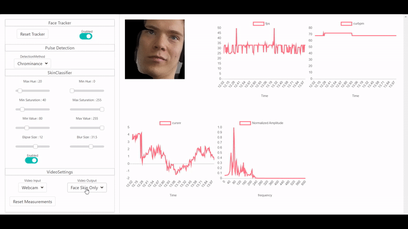

# Real Time Video Heartbeat Monitoring

This application can be used for expirements with video pulserate detection. It features an implementation of the chrominance method described in [1] and the PBV method described in [2]
The user interface was build using a web frontend since its impact on performance is significantly lower than similar interfaces in Python.

# Requirements

* Python3
* Flask
* Numpy
* Scipy
* OpenCV

IMPORTANT! : in the framecapture file you can select the camera you would like the program to use. Since I typically use the second camera I set the selected camera to 1.

# Background

The amount of blood in skin affects the color of the skin. You may have noticed when someone is blushing that the color of their skin has changed. However, invisible to the naked eye the regular circulation of blood through the face also causes a similar yet far more subtle variance in color. By capturing the the frequency of this color change an accurate estimate of the pulserate can be made. 

However, capturing this frequency is not an easy task. A number of factors such as motion, specular reflections and other intensity variations cause a lot of disturbance which makes the pulserate unrecognizable. However by applying the signal processing in  [1] and [2] the pulserate can often be recovered robustly.

# Demo
## Excellent stationary performance
The chrominance method robustly capturing the pulse rate (bpm) in a stationary situation 

## Skin Classifications
The motion robustness of the system can be improved with an interactive color-based skin classifier.

## PBV method
With the PBV method the motion robuustness can be improved further in most scenarios

# The files

In this section the important script files within the project are discussed. 

## Start

Run the start file with python to start the user-interface. This file contains the instructions that create the user interface and the main loop. The script is also responsible for starting the server. 

## Frame Capture 

The Mainloop starts at framecapture. This scripts uses a camera attached to the computer to capture a frame. Furthermore, a timestamp is saved so that inconsistencies in framerates can be compenstated before an attempt is made to detect the pulse rate. 

## Facetracker

Initially the facetracker attempts to detect in the received frames using opencv's haar cascade method. Once it has a found a face in the image it will use opencv's Mosse motion tracker to track the face. If for some reason the location of the face is no longer valid the tracker can be reset.

## Skin Classifer

The skin classifier attempts to blackout all the non-skin pixels remaining in the image. This is usefull for scenarios with a lot of motion since it reduces the color variations caused by the background.  

## RPPG Sensor

the rppg sensor meassures the raw ppg signal by calculating the average pixel of the pixels left in the frame. 

## Signal processor

The signal processor prepares the raw ppg signal for pulse detection by normalizing,detrending and bandpass filtering the signal. Afterwards, the signal is processed using either the chrominance or PBV method to find the pulse rate. 

## Evaluator

The evaluator selects the pulse rate and determines the signal to noise ratio.

## Server

The server is based on the lightweight FLASK API. It handles communication with the javascript user-interface. 

# References

1. Chrominance Method : Haan, G. De, & Jeanne, V. (2013). Robust pulse-rate from chrominance-based rPPG. (c), 1–9. https://doi.org/10.1109/TBME.2013.2266196
2. PBV Method : Wang, W., den Brinker, A. C., Stuijk, S., & de Haan, G. (2016). Algorithmic Principles of Remote PPG. IEEE Transactions on Bio-Medical Engineering, 64(7), 1479–1491. https://doi.org/10.1109/TBME.2016.2609282
3. Skin Classifier : https://www.pyimagesearch.com/2014/08/18/skin-detection-step-step-example-using-python-opencv/

